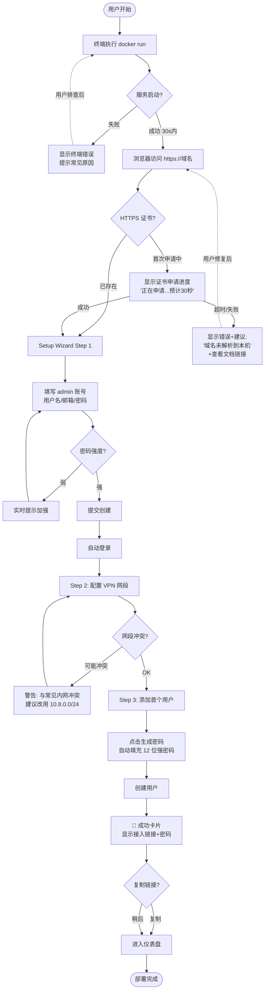
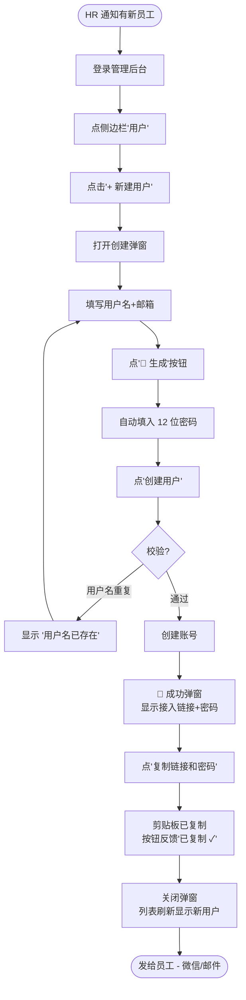
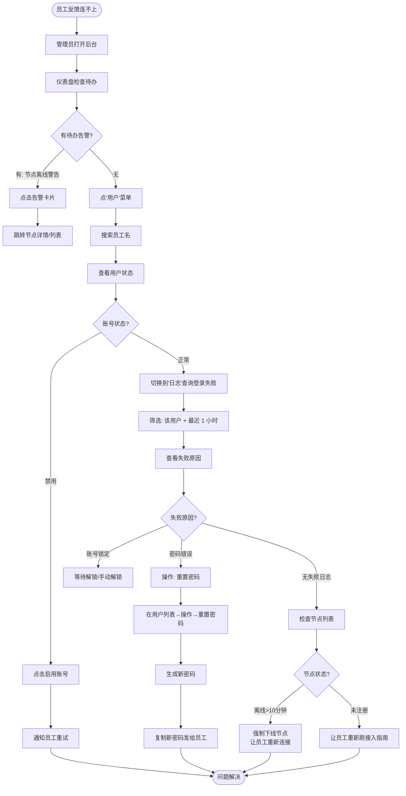
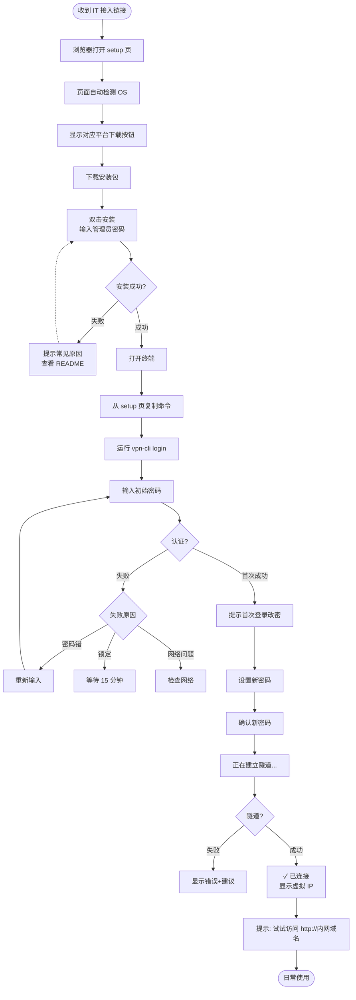
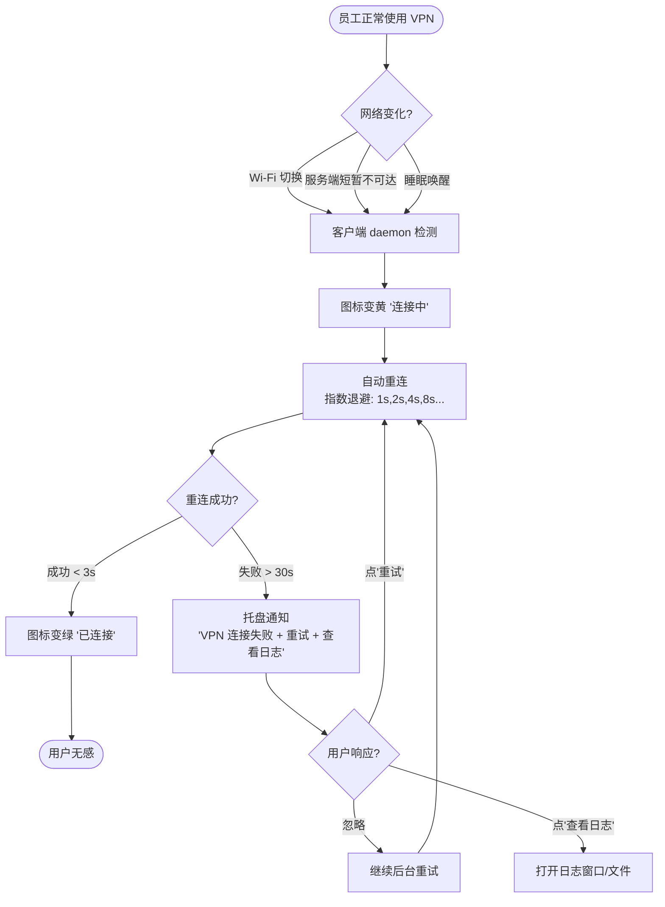

# UX Design Specification vpn

**Author:** Shangguanjunjie
**Date:** 2026-05-11

---

## Executive Summary

### Project Vision

构建一款**面向中小型企业（20–200 人）的自托管异地组网 VPN 管理后台**，让 IT 管理员 5 分钟完成部署、可视化完成全部日常运维，让普通员工通过引导页 3 分钟自助接入。

UX 设计的最高目标：让"易用性"成为可被直接感知的差异化（vs innernet 的命令行邀请码、NetBird 的复杂后台、Tailscale 的英文界面）。

### Target Users

**主要用户：IT 管理员（老王）**

- 角色：30–200 人企业的技术主管/IT 运维
- 设备：办公电脑（Mac/Win），主要使用浏览器
- 技术水平：熟悉命令行与基础运维，但希望日常操作零 SSH
- 关键需求：部署后即可视化管理、新员工接入零介入、故障可独立排查

**次要用户：普通员工（小李）**

- 角色：设计师/开发/销售等远程办公员工
- 设备：自己的 Mac/Win 笔记本
- 技术水平：能按指南操作，但不理解 VPN 技术细节
- 关键需求：跟随中文指南装好客户端、密码登录、连上即可

### Key Design Challenges

1. **跨设备工作流割裂** — 管理员在浏览器后台操作，员工在客户端 CLI 操作；UI 必须为两端流程提供清晰桥梁（如生成"员工接入指南"链接）
2. **技术黑盒对小白用户的体验** — 员工不需要理解虚拟 IP / 隧道 / 握手，UI 应隐藏这些概念，只显示"已连接"或"连接失败 + 一键操作"
3. **故障排查路径可操作化** — 后台显示登录失败原因时，必须配套"建议操作"（如"密码错误 → 重置密码"按钮）
4. **中文化深度** — 不仅是翻译，还要符合中文用户习惯（如时间显示、错误提示语气、字段顺序）
5. **跨设备桌面优先** — MVP 不做移动适配，但管理员可能在不同显示器上使用，需支持 1280×720 到 4K 的桌面尺寸

### Design Opportunities

1. **First-Run Wizard（首次部署引导）** — 把"5 分钟开箱即用"承诺通过 3 步向导可视化（设置 admin / 配置网段 / 创建第一个用户），强化产品差异化
2. **节点状态实时仪表盘** — 用色彩 + 动效呈现节点在线/离线/连接中状态，超越 innernet/NetBird 的纯表格体验
3. **员工接入引导页（二维码 + 短链接）** — 老王创建用户后一键复制"接入链接"，小李扫码直达 setup 页面 → 自动检测 OS → 下载对应客户端 → 显示登录指令
4. **错误即操作（Error as Action）** — 每个错误提示直接挂载可操作按钮（如"密码错 → 重置"、"节点离线 → 强制下线"、"端口被占 → 查看说明"）
5. **零学习成本的 Admin UI** — 主导航不超过 4 项（仪表盘、用户、节点、日志）；任何高级功能折叠在二级菜单

## Core User Experience

### Defining Experience

**核心交互（按用户分）：**

**IT 管理员（老王）：**

- 高频操作：查看节点在线状态（每天瞄一眼）
- 关键操作：添加新员工账号（每月几次）、排查故障（偶发但重要）
- 核心循环：登录后台 → 看仪表盘 → 处理待办（新员工/故障）→ 关闭浏览器

**普通员工（小李）：**

- 核心操作：仅"连上 VPN"这一件事
- 理想状态：装完客户端后再也不主动操作；后台 daemon 默默工作
- 关键时刻：第一次登录看到"已连接"那一刻

**唯一最重要的交互（One Critical Interaction）：**

对管理员是"**5 分钟内完成首次部署 + 首个客户端连接**"——这是产品差异化承诺的可视化验证时刻。

对员工是"**输入密码后立即看到已连接**"——这是产品价值兑现时刻。

### Platform Strategy

**MVP 平台决策：**

| 平台 | 用户 | 形态 | 优先级 |
|------|------|------|-------|
| Web Admin UI | IT 管理员 | 桌面浏览器 SPA（Chrome/Edge/Safari/Firefox 最近 2 版本） | P0 |
| Setup 引导页 | 员工 + 管理员 | 公开 Web 页面（手机也能看，但下载客户端在桌面） | P0 |
| CLI 客户端 | 全部用户 | macOS/Linux/Windows 终端 | P0 |
| 桌面 GUI 客户端 | 员工（提升体验） | Tauri 跨平台 | Growth 阶段（非 MVP） |
| 移动端 | 员工 | iOS/Android 原生 | Vision（非 MVP） |

**关键约束：**

- 鼠标键盘交互优先，不为触屏优化
- 桌面尺寸 1280×720 至 4K 自适应；不支持手机访问后台
- 浏览器仅支持现代标准（无 IE 11 兼容）
- 客户端 daemon 必须支持系统重启自动启动（系统集成）

### Effortless Interactions

**应该"零思考"完成的交互：**

1. **服务端首次部署到看到登录页** — 一条 docker run 命令 + 浏览器输入域名 = 自动 HTTPS + 引导界面
2. **添加新员工** — 填用户名+邮箱 → 点击"创建" → 系统自动生成密码 → 一键复制接入链接
3. **员工首次连接** — 装好客户端 → 点击桌面快捷方式（或 `vpn-cli login`）→ 输入密码 → 自动连接
4. **客户端断线恢复** — 完全无感，daemon 自动重连，员工根本不知道断过
5. **强制下线异常节点** — 老王看到一个节点显示"离线 12 分钟"，点"移除"按钮即完成

**自动化（无需用户介入）：**

- HTTPS 证书申请与续期
- 客户端断线重连（指数退避）
- 客户端常驻 daemon 开机自启
- 节点心跳与状态更新
- 离线节点自动标记

### Critical Success Moments

**Moment 1 — 管理员首次部署成功（产品差异化兑现）**

- 时间点：从 docker run 到管理后台 setup 页面打开
- 体验：进度条/或自动跳转，让用户看到"自动 HTTPS 申请中"等积极反馈
- 失败影响：如果超过 5 分钟或卡在不明阶段，用户会放弃产品

**Moment 2 — 员工首次连接成功（用户信任建立）**

- 时间点：输入密码后 ≤ 3 秒看到"已连接 IP: 10.8.0.5"
- 体验：终端绿色 ✓ + 明确显示虚拟 IP；如失败要给出明确原因
- 失败影响：员工对 IT 失去信任，要求换回旧方案

**Moment 3 — 管理员独立完成故障排查（运维体验差异化）**

- 时间点：员工反馈连不上 → 老王打开后台 → 30 秒内定位原因
- 体验：登录日志清晰呈现失败原因；节点列表清晰显示离线状态；每条错误都附"建议操作"
- 失败影响：老王要 SSH 进服务器看日志，则"零运维"承诺破产

**Moment 4 — 断线后自动重连（信任建立）**

- 时间点：员工切换 Wi-Fi/醒来/出差换网络
- 体验：客户端图标黄色→绿色 1–3 秒，员工没察觉
- 失败影响：员工每天要手动重连，会抱怨"还不如不用"

### Experience Principles

**5 条 UX 原则（指导后续所有设计决策）：**

1. **"零文档"原则** — 任何 MVP 功能都应该不依赖文档就能用；如果需要文档解释，说明 UI 还不够好
2. **"中文优先"原则** — 不是翻译，是从中文用户习惯出发设计（包括字段顺序、时间格式、错误措辞）
3. **"错误即操作"原则** — 任何错误提示都必须附带"建议操作"按钮或链接，禁止纯技术错误码
4. **"3 步内可完成"原则** — 任何 MVP 高频操作（添加用户、查看节点、重置密码）从登录后到完成 ≤ 3 次点击
5. **"管理员零 SSH"原则** — 部署完成后所有日常运维必须可在浏览器内完成；这是核心差异化护栏，任何破坏此原则的设计必须打回

## Desired Emotional Response

### Primary Emotional Goals

**IT 管理员（老王）：从"混乱"到"掌控"**

核心情感目标：**被赋能（Empowered）** + **从容（Composed）**

老王原本疲于奔命改 hosts、远程桌面、半夜被叫起来排查。使用本产品后应感受到："终于有一个工具站在我这边"——他不再是被动救火，而是主动掌控全局；后台告诉他需要知道的一切，他不需要去服务器深处挖日志。

**普通员工（小李）：从"忐忑"到"安心"**

核心情感目标：**被照顾（Cared For）** + **隐形（Invisible Trust）**

小李对 VPN 这种技术工具天然有焦虑感，担心装坏自己电脑、担心连不上耽误工作。使用本产品后应感受到："这个东西不需要我懂"——客户端默默工作，每天打开电脑就已连接，她可以忘记它的存在。

### Emotional Journey Mapping

**管理员情感曲线：**

| 阶段 | 用户感受 | UX 责任 |
|------|---------|--------|
| 初见产品（GitHub README） | 好奇 + 半信半疑 | 截图清晰、quickstart 醒目，让"5 分钟"承诺有视觉证据 |
| 服务端部署 | 紧张 → 期待 → 兴奋 | 部署阶段显示明确进度（"申请 HTTPS 证书中…"），完成时显眼的 ✓ |
| 首次进入后台 | 探索 + 略迷茫 | 引导式 setup wizard，明确"接下来做什么" |
| 添加第一个员工 | 满足（完成任务） | "已生成接入链接，请分享"——一键复制反馈即时 |
| 排查首次故障 | 警觉 → 平静 → 自豪 | 后台清晰显示问题 + 建议操作，老王完成排查后会有"我搞定了"的成就感 |
| 日常运维 | 平静、安心 | 仪表盘一眼看尽，无需深入；偶发问题有红点提醒 |

**员工情感曲线：**

| 阶段 | 用户感受 | UX 责任 |
|------|---------|--------|
| 收到 IT 发的接入链接 | 困惑（"又要装什么？"）| 引导页第一句话就是"3 分钟完成"，缓解焦虑 |
| 下载客户端 | 谨慎（"会不会有病毒？"）| 显示官方签名、文件大小合理、安装步骤清晰 |
| 首次登录 | 紧张 | 输入密码后立即给"已连接 ✓"反馈，绿色高亮 |
| 首次访问内网资源 | 惊喜（"哦真的通了！"）| 连接成功提示中加一句"试试访问 http://内网域名" |
| 日常使用 | 隐形（理想状态） | 不打扰、不弹窗、不询问；只有出问题时才出现 |
| 断线场景 | 不应该感知到 | 自动重连完成；除非超过 30s 才托盘通知 |

### Micro-Emotions

**最关键的微情感：**

| 微情感 | 触发场景 | 设计应对 |
|-------|---------|--------|
| **信心（Confidence）** | 首次部署看到进度反馈 | 不要静默等待，显示当前在干什么 |
| **信任（Trust）** | 看到中文、看到稳定运行 30 天 | 中文优先、版本号显眼、不出 bug |
| **从容（Composure）** | 出现错误时 | 错误描述+建议操作；不暴露原始堆栈 |
| **成就感（Accomplishment）** | 完成首次部署、第一次解决故障 | 成功反馈要明显（绿色 ✓，简洁庆贺语） |
| **隐形（Invisibility）** | 员工日常 VPN 在线 | 没消息就是好消息；不打扰、不弹窗、不通知 |

**要避免的负面微情感：**

| 负面情感 | 危险场景 | 避免做法 |
|---------|---------|--------|
| **焦虑（Anxiety）** | 部署时静默 / 错误时报"unknown error" | 始终显示明确状态与下一步 |
| **困惑（Confusion）** | 暴露技术黑话（"TLS 握手失败"、"netlink 错误"） | 翻译为业务语言；技术细节在"详情"折叠 |
| **挫败（Frustration）** | 点了没反应 / 重要操作要确认两次 | 即时视觉反馈 + 减少确认弹窗（只在不可逆操作前确认） |
| **不信任（Distrust）** | 英文混杂中文 / 排版崩坏 / 拼写错误 | 严格中文一致性 + 设计规范统一 |

### Design Implications

**情感目标 → UX 设计选择映射：**

1. **目标"被赋能"** → 后台主页是"行动仪表盘"（待办+异常突出），不是"信息墙"（一堆数字图表）
2. **目标"从容"** → 错误页/失败提示设计上等同于成功页（一样的视觉重量），不夸张报警、不渲染恐慌
3. **目标"信任"** → 视觉一致性极高（统一的色板/字体/间距）；避免装饰过度（不用 emoji、不用渐变光效）
4. **目标"隐形"** → 客户端默认行为：装好后开机自启、断线自动重连、不弹通知、托盘图标变绿不闪烁
5. **目标"成就感"** → 关键操作完成后给一个明确反馈（如部署成功跳出"🎉 部署完成 - 立即添加第一个用户"卡片）

### Emotional Design Principles

**4 条情感设计原则：**

1. **"工具应当谦逊"** — 不抢戏，不秀技术，不打扰用户；用户应该专注自己的工作而非工具本身
2. **"反馈不能延迟"** — 任何用户操作都要在 100ms 内有视觉反应；按钮按下变色、加载时显示骨架屏
3. **"失败要可恢复"** — 错误状态都附"重试"或"恢复"路径；不让用户陷入"做错了无法挽回"的恐慌
4. **"庆祝小成功"** — 第一次部署、第一次连接、首个员工接入——这些里程碑值得明确反馈（绿色 ✓ + 一句话肯定），强化用户对产品的正面情感联结

## UX Pattern Analysis & Inspiration

### Inspiring Products Analysis

**A. Tailscale Admin Console（直接竞品）**

- 解决了：可视化呈现 Mesh 网络节点拓扑
- 学习点：节点状态用色彩点（绿/灰/黄）+ 名称呈现；"Send invitation link" 把账号创建简化为一个动作；控制台首页是"Machines"列表（用户最常看的），不是数字仪表盘
- 局限：英文优先；商业付费；功能太多导致初次使用者迷茫
- 我们的取舍：**保留**节点列表为首页、状态色彩、邀请链接模式；**改进**中文优先、功能精简

**B. 1Password / Bitwarden Admin（账号管理参考）**

- 解决了：让 IT 管理员能安全地为团队成员管理凭据
- 学习点：强密码生成器内嵌在用户创建表单；"Send via Secure Link" 模式（一次性查看链接，过期失效）；用户列表清晰显示"最后活动时间"
- 我们的取舍：**直接采用**密码生成 + 接入链接模式；**adapt** 一次性查看模式给员工初始密码

**C. Vercel Dashboard（部署体验参考）**

- 解决了：让开发者从代码提交到部署上线感受到"魔法"
- 学习点：实时日志流（部署过程中显示每一步状态）；极简空状态；成功页面庆贺感（绿色 ✓ + 一键访问按钮）
- 我们的取舍：**首次部署引导**借鉴 Vercel 的"日志流 + 成功庆贺"模式

**D. Linear（运维操作速度参考）**

- 解决了：让团队成员高效完成日常任务，"快"是核心体验
- 学习点：键盘快捷键全局可用；操作反馈在 100ms 内；极简侧边栏（仅 5 项主导航）
- 我们的取舍：**adapt** 极简侧边栏（4 项导航）+ 关键操作快捷键（如 `N` 新建用户）

**E. 飞书管理后台（中文化参考）**

- 解决了：服务中国企业用户的管理体验
- 学习点：中文字段顺序符合本土习惯；时间显示"3 分钟前"而非完整时间戳；用语温和
- 我们的取舍：**全面采用**中文用户习惯（顺序、时间表示、用语）

**F. UpTime Kuma / Forgejo（自托管开源工具 UX 参考）**

- 解决了：开源 + 自托管工具如何做到不输商业产品的 UX
- 学习点：部署 quickstart 在 README 占据首屏；默认配置即可工作；中文社区参与度高
- 我们的取舍：**直接借鉴** README 截图占据首屏、零配置默认

### Transferable UX Patterns

**导航模式：**

- 极简侧边栏（4 项主导航：仪表盘 / 用户 / 节点 / 日志）← Linear / Tailscale
- 顶部固定 admin 头像菜单（修改密码 / 注销）← 通用 SaaS 模式

**交互模式：**

- 创建表单内嵌密码生成器 ← 1Password
- 成功操作后弹出"下一步建议"卡片 ← Vercel（如创建用户后 → "复制接入链接发给员工"）
- 一键复制按钮带反馈（点击后变为"已复制 ✓" 2 秒）← 通用模式
- 节点状态色彩点 + 名称（不用大图标）← Tailscale

**视觉模式：**

- Ant Design Pro 默认色板（中文场景验证最广）
- 节点状态色：在线绿 #52c41a / 离线灰 #d9d9d9 / 异常红 #ff4d4f / 连接中黄 #faad14
- 数据密度：表格行高 48px（不挤压不松散）
- 关键数字大号字体（仪表盘 KPI）

**反馈模式：**

- Loading 用骨架屏，不用 spinner（避免"卡住"错觉）
- 错误用 Notification 右上角弹出（不打断当前操作）
- 成功操作用页面内 Alert（停留 3 秒后自动消失）

**首次体验模式：**

- 部署完成后的 setup wizard（3 步：管理员账号 / 网段配置 / 首个用户）← Forgejo
- 部署过程的实时日志流（"申请 HTTPS 证书中..." → "✓ 证书获取成功"）← Vercel

### Anti-Patterns to Avoid

1. **避免"信息墙"型仪表盘** — 不要堆砌一堆图表数字（如 Grafana 风格），中小企业管理员只需要"今天有问题吗"这一个答案。仪表盘聚焦"待办与异常"
2. **避免双重确认** — 不要"删除用户"后还弹"真的要删除吗"。对不可逆操作用 outline 按钮 + 一次清晰确认即可
3. **避免技术黑话** — 后台不应出现"netlink"、"TLS handshake"、"WireGuard peer"，全部用业务语言（节点、连接、用户）
4. **避免英文混排** — 严格中文 UI，技术配置项也用中文（如 "VPN 网段"而非"CIDR Subnet"）
5. **避免设置嵌套深度** — 任何设置项最多 2 层（侧边栏 > 子页），不学传统企业软件的"系统管理 > 安全配置 > 认证设置 > 密码策略"
6. **避免过度动效** — 不用 lottie 动画、不用渐变光效、不用模糊背景。工具感优于娱乐感
7. **避免诱导操作** — 不弹"升级到 Pro"、"加入社区获取支持"等运营弹窗；产品是工具，不是漏斗
8. **避免 onboarding 教程视频** — 如果需要教程视频说明 UI 设计失败；MVP 阶段只通过 UI 引导

### Design Inspiration Strategy

**What to Adopt（直接采用）：**

| 模式 | 来源 | 用途 |
|------|------|------|
| 节点列表为首页 + 状态色彩点 | Tailscale | 仪表盘首屏 |
| 密码生成器内嵌创建表单 | 1Password | 添加用户表单 |
| 实时日志流 + 成功庆贺 | Vercel | 首次部署引导 |
| 极简 4 项侧边栏 | Linear | 主导航 |
| Ant Design Pro 色板与组件 | 飞书/AntD | 整体视觉系统 |
| 一键复制带反馈 | 通用模式 | 接入链接、虚拟 IP |
| 中文用户习惯（顺序/时间/用语） | 飞书 | 全局 |

**What to Adapt（改造采用）：**

| 模式 | 来源 | 改造方向 |
|------|------|---------|
| 邀请链接模式 | Tailscale | 改为账号密码 + 接入指南链接（适合中小企业自管账号场景） |
| Setup Wizard | Forgejo | 简化为 3 步（admin / 网段 / 首用户） |
| 一次性查看链接 | 1Password | 用于员工初始密码分享（强制首次改密替代过期） |
| 全局快捷键 | Linear | MVP 仅 1–2 个最常用（如 `N` 新建用户）；不全套引入 |

**What to Avoid（明确不做）：**

| 反模式 | 原因 |
|-------|------|
| 全套 Tailscale UI 复杂度 | 我们的用户不需要 Mesh 路由、子网共享、ACL 这些高级功能 |
| 阿里云控制台风格 | 太重，且面向大企业；中小企业管理员会被"导航树深 5 层"吓退 |
| Grafana 仪表盘风格 | 数字图表多但反映不出"今天有没有事" |
| 商业 SaaS 的 onboarding 弹窗序列 | 不导购、不诱导升级，纯工具体验 |
| 双语切换器 | MVP 单语（中文），不引入额外切换成本 |

**核心策略：**

> "Linear 的速度 + Tailscale 的清爽 + 飞书的中文 + Vercel 的部署体验 - innernet 的极客感 - Aliyun 控制台的厚重 - SaaS 的运营干扰"

## Design System Foundation

### 1.1 Design System Choice

**选择：Ant Design Pro 5.x（基于 Ant Design 5.x 核心组件库）**

技术栈细节：

- **核心组件库**：`antd@5.x`（Ant Design 5.x，原子组件）
- **业务组件**：`@ant-design/pro-components@2.x`（ProTable / ProForm / ProLayout / ProDescriptions 等管理后台高阶组件）
- **图标**：`@ant-design/icons@5.x`
- **构建工具**：Vite + React 18 + TypeScript（不使用 Umi，降低复杂度）

### Rationale for Selection

**为什么 Ant Design Pro 而不是其他选择：**

| 备选 | 优势 | 不选原因 |
|------|------|---------|
| Custom Design System | 视觉独特 | MVP 阶段投入产出比极低；中小企业管理后台不需要视觉差异化 |
| Material UI (MUI) | Google 生态、国际通用 | 中文场景适配较弱；ProTable 等管理后台高阶组件缺失 |
| shadcn/ui + Tailwind | 现代、轻量、可定制 | 缺成熟的中文 + 企业管理后台组件库；需大量自建 |
| Element Plus | 中文 Vue 生态 | 本项目前端选 React 而非 Vue |
| ✅ **Ant Design Pro** | 中文一线企业（蚂蚁/字节/腾讯）大规模验证；ProTable/ProForm 一行代码生成管理后台；中文文档与社区最完善 | **选定** |

**核心理由：**

1. **匹配中小企业 IT 管理员心智模型** — 国内程序员/IT 大多见过 AntD 风格，零学习成本
2. **管理后台高阶组件齐全** — ProTable 一组件解决"列表 + 搜索 + 分页 + 操作列"，节省 80% 表格代码
3. **中文优先** — 默认提供中文 locale，所有组件文案、日期格式、提示语都已本地化
4. **TypeScript 友好** — 完整的类型定义，与 PRD 中定义的数据契约（User/Peer 等）天然契合
5. **可视觉裁剪** — 通过 ConfigProvider + cssVars 可统一调整品牌色，无需 fork 整个 lib

### Implementation Approach

**前端技术栈（完整）：**

```json
{
  "构建": "Vite 5.x + React 18 + TypeScript 5.x",
  "UI 组件库": "antd@5.x + @ant-design/pro-components@2.x",
  "状态管理": {
    "服务端状态": "@tanstack/react-query@5.x (用户列表、节点列表等 HTTP 数据)",
    "客户端状态": "zustand@4.x (WebSocket 实时节点状态、UI 全局状态)"
  },
  "路由": "react-router-dom@6.x",
  "HTTP 客户端": "axios@1.x",
  "图表（仪表盘）": "@ant-design/charts@2.x（仅 1–2 个图，非核心）",
  "代码规范": "ESLint + Prettier + TypeScript strict",
  "测试": "Vitest + React Testing Library"
}
```

**项目结构：**

```
frontend/
├── src/
│   ├── pages/
│   │   ├── setup/          # 首次部署引导（公开）
│   │   ├── login/          # 登录页
│   │   ├── dashboard/      # 仪表盘（首页）
│   │   ├── users/          # 用户管理
│   │   ├── peers/          # 节点管理
│   │   └── audit-logs/     # 审计日志
│   ├── components/
│   │   ├── layout/         # ProLayout 主框架
│   │   ├── status/         # 节点状态标签等通用组件
│   │   └── feedback/       # 错误/成功提示组件
│   ├── stores/             # Zustand 状态
│   ├── hooks/              # 自定义 Hook（含 useWebSocket）
│   ├── services/           # API 层（Axios）
│   ├── types/              # TS 类型定义（与后端 contract 对齐）
│   └── utils/
├── public/
└── index.html
```

**构建产物：** 静态 SPA（index.html + 静态资源），由 Axum 后端服务静态文件或 Nginx 代理

### Customization Strategy

**视觉裁剪（保持 AntD 主体不变，仅微调）：**

```typescript
// theme.ts
export const theme = {
  token: {
    colorPrimary: '#2F54EB',        // 主色（AntD 默认蓝偏深，专业感）
    colorSuccess: '#52C41A',         // 节点在线
    colorWarning: '#FAAD14',         // 连接中
    colorError: '#FF4D4F',           // 异常/离线
    borderRadius: 4,                 // 较小圆角（工具感）
    fontFamily: '-apple-system, BlinkMacSystemFont, "PingFang SC", "Microsoft YaHei", sans-serif',
  },
  components: {
    Layout: {
      siderBg: '#001529',            // 深色侧边栏（专业）
      headerBg: '#FFFFFF',
    },
    Table: {
      rowHoverBg: '#FAFAFA',
      headerBg: '#FAFAFA',
    },
  },
};
```

**自建组件清单（AntD 没有的）：**

| 组件 | 用途 | 实现复杂度 |
|------|------|----------|
| `<NodeStatusDot>` | 节点状态色点（绿/灰/黄/红）+ 名称 | 低 |
| `<SetupWizard>` | 首次部署 3 步引导 | 中（基于 Steps + Form） |
| `<CopyLink>` | 接入链接一键复制 + 反馈 | 低 |
| `<DeployLogStream>` | 部署日志实时流（非 MVP 必需，作为强化体验） | 中 |
| `<ConnectionGuide>` | 员工 setup 引导页核心组件 | 中 |

**i18n 策略：**

- MVP 仅中文（zh-CN）；不引入 i18next，所有文案硬编码中文
- 后续国际化通过 AntD ConfigProvider locale 切换 + 文案常量提取（Phase 3+）

**性能策略：**

- 路由级 lazy load（`React.lazy` + `Suspense`）
- ProTable 大数据列表自动开启虚拟滚动
- 图标按需引入（`@ant-design/icons` tree-shaking）
- 构建产物分析（rollup-plugin-visualizer）控制单 chunk < 500KB

**响应式策略：**

- 桌面优先：基准 1440×900
- 自适应 1280×720 至 4K（流式布局 + AntD Grid 24 栅格）
- 不为移动适配，但保证 768px 以下不破版

**辅助库（外围）：**

- `dayjs`（时间处理，AntD 默认）
- `clipboard-copy`（一键复制兜底）
- 不引入 lodash（AntD 已内置 rc-util）；按需 import-cost 严格控制

## 2. Core User Experience

### 2.1 Defining Experience

**核心定义体验：3 分钟从零到首个 VPN 连接建立**

如果用一句话向朋友介绍：**"docker run 一下，登录后台填个用户名，员工就能连上公司内网。"**

这是本产品价值兑现的"魔法时刻"序列：

```
[docker run] → [浏览器访问] → [Setup 向导 3 步] → [复制接入链接] → [员工安装客户端] → [输入密码] → [✓ 已连接]
   30s             10s              90s                5s              60s              10s          3s
```

整条主线 ≤ 3 分钟（管理员），员工首次接入 ≤ 1.5 分钟。

**这一条体验必须做到极致，因为：**

- 这是 README 文档承诺的兑现时刻
- 这决定了 GitHub 访问者会不会留下来用产品
- 这是用户对产品质量的第一印象

### 2.2 User Mental Model

**IT 管理员的心智模型：**

- 心智参照：搭建 Nginx / 启动 GitLab / 部署 UptimeKuma（类似的自托管工具体验）
- 期望路径："docker run 启动 → 浏览器访问 → 看到登录页 → 跟着引导走"
- 害怕的：要改一堆配置文件、要查文档、要装一堆依赖、装完不知道下一步
- 心智阻力：如果第 30 秒还没看到任何反馈，会怀疑卡住了

**普通员工的心智模型：**

- 心智参照：装个微信 / 装个 VPN 客户端（如 Tailscale/V2Ray，但更简单）
- 期望路径："装好打开 → 输入账号密码 → 连上"
- 害怕的：会不会装坏电脑、网络费不费流量、需不需要懂技术
- 心智阻力：技术词汇（虚拟 IP、隧道）会让小李关闭客户端

**当前其他方案的痛点（参考心智）：**

- **innernet**：要在命令行用 invitation token，员工要懂 `innernet install`，对小李是天书
- **NetBird**：要先注册账号 → 创建网络 → 配置 SSO → 装 agent → 加入网络，5+ 步骤
- **OpenVPN**：员工要从 admin 那里拿 .ovpn 文件，admin 要会用证书工具
- **Tailscale**：英文 + 商业付费，且需要登录 Google/GitHub（很多企业不允许）

我们的设计承诺：**从 "下载/部署" 到 "连接成功"，全程不超过 5 步用户操作**。

### 2.3 Success Criteria

**核心体验的成功指标（来自 PRD §3）：**

| 指标 | 目标 | 验证方式 |
|------|------|---------|
| 管理员部署到登录后台 | ≤ 5 分钟 | 5 位无 VPN 经验者实测 |
| 管理员部署到首个客户端连接 | ≤ 30 分钟 | 5 位无 VPN 经验者实测 |
| 员工首次连接 | ≤ 3 分钟 | 5 位员工实测 |
| 部署成功率（无错误） | ≥ 80% | 新用户 README 跟随测试 |
| Setup 向导完成率 | ≥ 90% | 进入向导的用户最终完成的比例 |

**用户体感成功指标（定性）：**

- 部署完看到登录页时，用户会有"哇真的 5 分钟"的惊喜感
- 添加用户时，看到自动生成的接入链接，用户会觉得"哦这就行了？"
- 员工首次连接成功，看到绿色的"已连接 IP: 10.8.0.5"，会有"哦真的连上了"的释然
- 整个过程中，**没有任何一步需要查阅文档**

### 2.4 Novel vs. Established Patterns

**评估：本产品的核心体验 95% 基于已有 UX 模式，5% 创新组合**

**沿用已有模式（不需要教育用户）：**

- 表单输入（用户名+密码登录）— 通用 Web 模式
- 表格列表 + 搜索 + 分页（用户列表、节点列表）— 管理后台通用模式
- Steps 多步引导（Setup Wizard）— Antd/element-plus 标准模式
- CLI 命令式工具（`vpn-cli login`）— 程序员熟悉的 Git/Docker 模式
- 一键复制反馈（点击后变为"已复制"）— 通用 Web 模式

**创新组合（需要少量引导）：**

- **"接入链接 + 账号密码"双因素分享** — 管理员一键生成"链接 + 密码"组合，员工扫码或访问链接 → 自动跳到对应 OS 的下载页 → 输入密码即可。这种"链接打开 + 凭证输入"的两步式接入，比纯邀请码 / 纯账号密码都更适合中小企业场景
- **First-Run Wizard 内嵌部署反馈** — 在 Setup Wizard 第一页显示"服务端启动状态、HTTPS 证书状态"，让用户看到服务是健康的，不是 demo

**不引入任何需要 onboarding 教学视频的全新交互。**

### 2.5 Experience Mechanics

**管理员首次部署的详细机制：**

```
[阶段 1: docker run]
触发：用户在终端执行 docker run 命令
反馈：终端输出（用户在浏览器外）
完成：服务监听 443/8443 端口

[阶段 2: 浏览器访问 https://vpn.acme.com]
触发：用户在浏览器输入域名
反馈：
  - 如果域名解析正常 + ACME 证书已申请 → 直接看到 setup 页
  - 如果证书申请中（首次） → 显示 "正在为您申请 HTTPS 证书，预计 30 秒..." 进度条
  - 如果失败 → 明确错误 + 建议（如"域名未解析到本机 IP"）

[阶段 3: Setup Wizard 第 1 步 - 创建 Admin 账号]
界面元素：
  - 标题："欢迎使用 vpn — 让我们花 3 分钟完成设置"
  - 进度条：● ○ ○ (1/3)
  - 表单：用户名（默认 admin）/ 邮箱 / 密码（10 位以上，复杂度提示） / 确认密码
  - 按钮：[下一步 →]
交互：
  - 实时密码强度反馈（弱 / 中 / 强）
  - 邮箱格式即时校验
  - 输入完点击下一步 → 创建账号 → 自动登录 → 进入第 2 步

[阶段 4: Setup Wizard 第 2 步 - 配置 VPN 网段]
界面元素：
  - 进度条：● ● ○ (2/3)
  - 表单：
    - VPN 网段（默认 10.8.0.0/24，提示"可分配 254 个节点，与公司内网不重叠"）
    - 服务端公网域名（如 vpn.acme.com，已自动填入）
    - WireGuard 监听端口（默认 51820）
  - 按钮：[← 上一步] [下一步 →]
交互：
  - 网段冲突检测（如填 192.168.1.0/24 → 警告"可能与常见内网冲突"）
  - 一键生成服务端 WireGuard 密钥对
  - 下一步 → 后台生成配置 → 自动跳第 3 步

[阶段 5: Setup Wizard 第 3 步 - 添加首个用户]
界面元素：
  - 进度条：● ● ● (3/3)
  - 副标题："最后一步：添加第一个用户，他可以用客户端连接 VPN"
  - 表单：用户名 / 邮箱 / [生成密码] 按钮（生成 12 位强密码）
  - 按钮：[← 上一步] [完成设置 →]
交互：
  - 点"生成密码"自动填充密码字段（明文显示）
  - 点"完成" → 创建用户 → 进入主仪表盘
  - 弹出成功卡片：
    ┌──────────────────────────────────────────────┐
    │  🎉 设置完成！你的 VPN 已经可以用了             │
    │                                              │
    │  下一步：把接入链接发给你的同事                  │
    │                                              │
    │  📋 接入链接：https://vpn.acme.com/setup     │
    │  🔑 密码：abc123XYZ!                          │
    │                                              │
    │  [复制链接和密码]   [稍后再说]                  │
    └──────────────────────────────────────────────┘

[阶段 6: 仪表盘首屏]
界面元素：
  - 顶部欢迎卡片："欢迎使用 vpn，开始管理你的异地组网"
  - 数据卡：用户总数 1 / 在线节点 0 / 今日新增 0
  - 节点列表：空状态 → "还没有节点接入，把接入链接发给同事吧"
  - 引导：右上角有"教程"按钮（仅这一次出现，关闭后不再显示）
```

**员工首次接入的详细机制：**

```
[阶段 1: 收到接入链接 + 密码]
触发：员工收到老王发的 微信消息 / 邮件，含 https://vpn.acme.com/setup 和密码
反馈：员工点击链接 → 浏览器打开

[阶段 2: 引导页（公开访问）]
界面元素：
  - 标题："欢迎接入 vpn"
  - 副标题："3 步完成接入，全程不超过 3 分钟"
  - 步骤 1: 下载客户端
    - 自动检测 OS → 显示对应平台按钮（macOS .pkg / Windows .msi / Linux .deb）
    - 文件大小 / 签名提示
  - 步骤 2: 安装客户端
    - 截图指引（双击安装包 → 输入管理员密码 → 完成）
  - 步骤 3: 登录连接
    - 终端命令（可一键复制）：vpn-cli login admin@vpn.acme.com
    - 提示输入密码（从邮件复制）

[阶段 3: CLI 登录]
触发：员工在终端运行 vpn-cli login
反馈：
  - 提示：请输入密码（不回显）
  - 输入完 → "正在连接..." (2-3 秒)
  - 首次登录强制改密：
    [首次登录] 请设置新密码：
    [首次登录] 请确认新密码：
  - 成功：
    ✓ 已连接
      服务端：vpn.acme.com:51820
      虚拟 IP：10.8.0.5
      可访问内网：10.8.0.0/24
    提示：试试访问公司内网，如 http://wiki.acme.com

[阶段 4: 日常使用 - 隐形]
- 客户端 daemon 后台运行
- 系统重启自动连接（开机自启）
- 网络切换自动重连
- 用户无需任何操作

[阶段 5: 状态查询（可选）]
触发：员工想确认是否在线
命令：vpn-cli status
反馈：彩色终端输出当前状态
```

## Visual Design Foundation

### Color System

**色彩定位：专业、克制、信赖**

不追求活泼或个性化；偏 Linear / Notion 的"工具感"色调。所有色彩从 Ant Design 5.x 调色板中选取（经过中文场景大规模验证），保证全局一致性。

**主色板（Brand Colors）：**

| 用途 | 色值 | AntD Token | 使用场景 |
|------|------|----------|---------|
| Primary | `#2F54EB` | `colorPrimary` (geekblue-7) | 按钮、链接、激活状态、品牌色 |
| Primary Hover | `#5B7CFA` | (自动) | 主色 hover 状态 |
| Primary Active | `#1D39C4` | (自动) | 主色按下状态 |

> 选 geekblue 而非默认 daybreak blue 是为了体现"技术感"，避免营销 SaaS 的浅蓝调。

**语义色（Semantic Colors）—— 用于节点状态：**

| 状态 | 色值 | 含义 | 视觉位置 |
|------|------|------|---------|
| Success | `#52C41A` | 节点在线 / 操作成功 / 部署完成 | 节点列表状态点、成功提示 |
| Warning | `#FAAD14` | 节点连接中 / 配置异常但不影响业务 | 节点列表状态点、温和提示 |
| Error | `#FF4D4F` | 节点离线（超过 5 分钟） / 登录失败 / 系统错误 | 节点列表状态点、错误提示 |
| Info | `#1677FF` | 一般信息提示 | 通知、提示文案 |
| Disabled | `#D9D9D9` | 节点未注册 / 禁用账号 / 不可点击 | 灰显元素 |

**中性色板（Neutral Grays）：**

| 用途 | 色值 | 使用场景 |
|------|------|---------|
| Text Primary | `#000000D9` (rgba) | 主要正文、标题 |
| Text Secondary | `#00000073` | 辅助说明文字、时间戳 |
| Text Disabled | `#00000040` | 禁用状态文字 |
| Border | `#D9D9D9` | 表格边框、卡片边框 |
| Background Base | `#FFFFFF` | 主内容区背景 |
| Background Layout | `#F5F5F5` | 页面外边距背景（让主内容浮起来） |
| Background Hover | `#FAFAFA` | 行 hover、卡片 hover |
| Sider | `#001529` | 深色侧边栏（专业感） |

**对比度合规（WCAG 2.1 AA）：**

- 正文文字（`#000000D9` on `#FFFFFF`）= 18:1 ✓ (要求 4.5:1)
- 辅助文字（`#00000073` on `#FFFFFF`）= 5.7:1 ✓
- 主色按钮文字（`#FFFFFF` on `#2F54EB`）= 6.8:1 ✓
- 节点状态色（在 #FAFAFA 背景上）≥ 4.5:1 ✓

> 不为色盲做特殊配色（成本高且企业内网用户群体较小），但所有状态都配文字标签（"在线"/"离线"），不单依赖颜色传达信息。

### Typography System

**字体策略：系统字体优先（性能 + 中文优化）**

```css
font-family: -apple-system, BlinkMacSystemFont,
             "Segoe UI", "PingFang SC", "Hiragino Sans GB",
             "Microsoft YaHei", "Helvetica Neue", Helvetica,
             Arial, sans-serif;
```

**理由：**

- 不加载 Web Font（节省 200KB+ 资源，加快首屏）
- macOS 用 PingFang SC（最佳中文显示）
- Windows 用 Microsoft YaHei（系统自带）
- 自动适配 OS 默认字体，体验最佳

**等宽字体（CLI 命令展示、虚拟 IP 显示）：**

```css
font-family: "SF Mono", "Monaco", "Cascadia Code",
             "Roboto Mono", Consolas, "Liberation Mono",
             "Source Code Pro", "Menlo", "Courier New", monospace;
```

**类型层级（基于 AntD 默认）：**

| 层级 | 字号 | 行高 | 字重 | 使用场景 |
|------|------|------|------|---------|
| Display | 38px | 46px | 500 | 仪表盘大数字（如在线节点数） |
| H1 | 30px | 38px | 500 | 页面主标题 |
| H2 | 24px | 32px | 500 | 卡片主标题 |
| H3 | 20px | 28px | 500 | 区块小标题 |
| H4 | 16px | 24px | 500 | 表格标题 |
| Body | 14px | 22px | 400 | 主要正文、表格内容 |
| Caption | 12px | 20px | 400 | 辅助说明、时间戳、标签 |
| Code | 13px | 20px | 400 | 等宽字体：虚拟 IP、CLI 命令 |

**字重控制：**

- 仅使用 400（regular）和 500（medium），不使用 bold（700）
- 中文加粗效果在多数中文字体下不理想；500 已足够提供视觉层级
- 不引入 Light（300）—— 在小尺寸下中文不易读

### Spacing & Layout Foundation

**间距单位：4px 基准（Ant Design 标准）**

| Token | 像素 | 使用场景 |
|-------|------|---------|
| `xxs` | 4px | 标签内 padding、图标与文字间距 |
| `xs` | 8px | 表单字段内 padding、紧凑列表 |
| `sm` | 12px | 卡片小间距 |
| `md` | 16px | 默认间距（最常用） |
| `lg` | 24px | 卡片间距、分组间距 |
| `xl` | 32px | 大区块间距 |
| `xxl` | 48px | 页面 section 间距 |

**布局原则：**

1. **桌面优先，但保留下沉空间** — 基准 1440×900 设计，但所有界面在 1280×720 下也完整可见；4K 显示器通过最大宽度限制避免内容过散（主内容区 max-width: 1600px）
2. **极简栅格** — AntD 24 栅格系统；主内容区单列布局优先；多列仅用于仪表盘卡片
3. **数据密度** — 表格行高 48px（不挤压，便于扫读）；卡片 padding `lg`（24px）；表单字段间距 `md`（16px）
4. **空状态优先** — 任何列表/页面都有空状态设计；不显示空表格 + "暂无数据"四个字

**ProLayout 主框架结构：**

```
┌────────────────────────────────────────────────────┐
│ Header (高度 56px) | 项目 Logo + 项目名 ─── admin ▾ │
├──────────┬─────────────────────────────────────────┤
│          │                                         │
│  Sider   │            Content Area                 │
│  (200px) │            (max-width 1600px)           │
│          │            padding: 24px                │
│  深色背景 │                                         │
│          │                                         │
│  4 项主导航                                         │
│  ● 仪表盘                                          │
│  ● 用户                                            │
│  ● 节点                                            │
│  ● 日志                                            │
│          │                                         │
└──────────┴─────────────────────────────────────────┘
```

### Accessibility Considerations

**WCAG 2.1 Level A 目标（MVP 阶段，不追求 AA）：**

- 颜色对比度全部满足 4.5:1（正文）/ 3:1（大字号）
- 所有状态信息都配文字标签（不依赖纯颜色传达）
- 表单字段都有 label（不用 placeholder 代替 label）
- 关键操作有键盘可访问（Tab 顺序合理）
- 错误提示有清晰文字说明（不依赖红色边框）

**MVP 阶段不做的（成本高且 ROI 低）：**

- ARIA live region 屏幕阅读器优化
- 全键盘导航（Tab 全覆盖）
- 高对比度模式
- 屏幕阅读器测试

> 理由：目标用户是企业 IT 管理员和员工，无障碍需求场景有限；Phase 2 视用户反馈再优化。

**响应式断点（最小化，仅 4 档）：**

| 断点 | 宽度 | 行为 |
|------|------|------|
| xl | ≥ 1600px | 主内容区限宽 1600px 居中 |
| lg | 1280–1599px | 全宽布局（设计基准） |
| md | 768–1279px | 侧边栏可折叠（仅图标） |
| sm | < 768px | 简单警示页"请使用桌面端访问" |

## Design Direction Decision

### Design Directions Explored

基于已建立的约束（AntD Pro 设计系统、geekblue 主色、深色侧边栏、4 项主导航、桌面优先），设计方向空间极窄。我评估了 3 个理论变体：

| 变体 | 描述 | 评估 |
|------|------|------|
| **变体 A：经典管理后台**（推荐） | 深色侧边栏 + 浅色内容区 + AntD Pro 默认风格 | 符合所有已建立约束；零学习成本 |
| 变体 B：纯白扁平风（Linear 风） | 浅色侧边栏 + 极简边界 + 大量留白 | 偏离 AntD Pro 默认；视觉差异化 ROI 低 |
| 变体 C：紧凑数据风（Bloomberg 风） | 高密度表格 + 多面板分屏 + 深色主题 | 反"工具应当谦逊"原则；管理员场景不需要 |

**结论：选择变体 A（经典管理后台）。** 不生成 HTML 高保真稿；视觉细节由 AntD Pro 决定，下游开发直接对照已定义的 token 实现。

### Chosen Direction

**整体设计方向：经典 SaaS 管理后台 + Linear 的简约 + 飞书的中文友好**

**核心特征：**

- 深色侧边栏（#001529）+ 浅色内容区（白底 + 灰背）
- 主色 geekblue #2F54EB（按钮、链接、激活状态）
- 4 项主导航极简（仪表盘 / 用户 / 节点 / 日志），无嵌套
- 表格驱动（AntD ProTable）—— 列表是主要内容形态
- 卡片白底圆角 4px（克制不卡通）
- 全局中文 + 系统字体（无 Web Font）

### Key Screen Wireframes（关键页面线框）

#### A. Setup Wizard — 首次部署引导（Step 1/3：创建 Admin）

```
┌─────────────────────────────────────────────────────────────────┐
│                                                                 │
│              vpn — 让我们花 3 分钟完成设置                       │
│                                                                 │
│              进度：●  ○  ○   (1/3)                              │
│                                                                 │
│              ┌───────────────────────────────────┐              │
│              │  创建管理员账号                    │              │
│              │                                   │              │
│              │  用户名 *      admin             │              │
│              │  邮箱 *        admin@acme.com    │              │
│              │  密码 *        ●●●●●●●●●● 强    │              │
│              │  确认密码 *    ●●●●●●●●●●        │              │
│              │                                   │              │
│              │             [   下一步 →   ]      │              │
│              └───────────────────────────────────┘              │
│                                                                 │
└─────────────────────────────────────────────────────────────────┘
```

#### B. Login — 登录页

```
┌─────────────────────────────────────────────────────────────────┐
│                                                                 │
│                       [vpn LOGO]                                │
│                                                                 │
│              ┌───────────────────────────────────┐              │
│              │  欢迎回来                          │              │
│              │                                   │              │
│              │  用户名         _________________ │              │
│              │  密码           _________________ │              │
│              │                                   │              │
│              │  [   登录   ]                      │              │
│              │                                   │              │
│              │  忘记密码？请联系管理员             │              │
│              └───────────────────────────────────┘              │
│                                                                 │
└─────────────────────────────────────────────────────────────────┘
```

#### C. Dashboard — 仪表盘首页

```
┌──────────┬──────────────────────────────────────────────────────┐
│  vpn     │ 仪表盘                                  admin ▾       │
│          ├──────────────────────────────────────────────────────┤
│  ● 仪表盘 │                                                       │
│  ○ 用户   │  ┌──────────┐ ┌──────────┐ ┌──────────┐ ┌──────────┐│
│  ○ 节点   │  │ 用户总数  │ │ 在线节点  │ │ 离线节点  │ │ 今日新增  ││
│  ○ 日志   │  │   12     │ │   8      │ │   2      │ │   1      ││
│          │  └──────────┘ └──────────┘ └──────────┘ └──────────┘│
│          │                                                       │
│          │  最近接入的节点                       [查看全部 →]    │
│          │  ┌──────────────────────────────────────────────────┐│
│          │  │ ● 在线  lin's MacBook    10.8.0.5  2 分钟前    [···]││
│          │  │ ● 在线  老王 ThinkPad     10.8.0.2  5 分钟前    [···]││
│          │  │ ● 离线  陈三 Windows-PC   10.8.0.7  12 分钟前  [···]││
│          │  └──────────────────────────────────────────────────┘│
│          │                                                       │
│          │  待办  (1)                                            │
│          │  ⚠ 节点 "陈三 Windows-PC" 离线超过 10 分钟  [处理]    │
│          │                                                       │
└──────────┴──────────────────────────────────────────────────────┘
```

#### D. Users — 用户管理页

```
┌──────────┬──────────────────────────────────────────────────────┐
│  vpn     │ 用户管理                                  admin ▾    │
│          ├──────────────────────────────────────────────────────┤
│  ○ 仪表盘 │                                                       │
│  ● 用户   │  搜索：[___________]  状态：[全部 ▾]      [+ 新建用户]│
│  ○ 节点   │                                                       │
│  ○ 日志   │  ┌────────────────────────────────────────────────┐│
│          │  │ 用户名    邮箱           状态  最后登录  操作    ││
│          │  ├────────────────────────────────────────────────┤│
│          │  │ admin    admin@..       正常  2 分钟前   [···] ││
│          │  │ lin      lin@acme.com   正常  1 小时前   [···] ││
│          │  │ chen     chen@acme.com  正常  3 天前     [···] ││
│          │  │ zhao     zhao@acme.com  禁用  从未       [···] ││
│          │  └────────────────────────────────────────────────┘│
│          │                                  共 4 条  < 1 >     │
└──────────┴──────────────────────────────────────────────────────┘
```

#### E. Create User Modal — 创建用户弹窗

```
            ┌───────────────────────────────────────────┐
            │  新建用户                            ✕    │
            ├───────────────────────────────────────────┤
            │                                           │
            │  用户名 *    [_________________________]  │
            │  邮箱 *      [_________________________]  │
            │  初始密码 *  [abcXYZ123!@#]   [🎲 生成]  │
            │                                           │
            │  ⓘ 用户首次登录时需修改密码                │
            │                                           │
            │            [取消]    [创建用户]            │
            └───────────────────────────────────────────┘

            创建成功后：

            ┌───────────────────────────────────────────┐
            │  🎉 用户 "lin" 创建成功                    │
            │                                           │
            │  请把以下信息发给该用户：                  │
            │                                           │
            │  📋 接入链接：                              │
            │  https://vpn.acme.com/setup               │
            │  🔑 初始密码：abcXYZ123!@#                  │
            │                                           │
            │  [📄 复制链接和密码]    [完成]             │
            └───────────────────────────────────────────┘
```

#### F. Peers — 节点列表页

```
┌──────────┬──────────────────────────────────────────────────────┐
│  vpn     │ 节点管理                                  admin ▾    │
│          ├──────────────────────────────────────────────────────┤
│  ○ 仪表盘 │                                                       │
│  ○ 用户   │  搜索：[___________]  状态：[全部 ▾]                  │
│  ● 节点   │                                                       │
│  ○ 日志   │  ┌────────────────────────────────────────────────┐│
│          │  │状态  设备名      所属用户  虚拟IP    最后心跳     操作│
│          │  ├────────────────────────────────────────────────┤│
│          │  │ ●   lin's Mac   lin     10.8.0.5   2 分钟前  [···]│
│          │  │ ●   老王 TP     admin   10.8.0.2   5 分钟前  [···]│
│          │  │ ○   陈三 PC     chen    10.8.0.7   12 分钟前 [···]│
│          │  └────────────────────────────────────────────────┘│
└──────────┴──────────────────────────────────────────────────────┘
```

#### G. Audit Logs — 审计日志页

```
┌──────────┬──────────────────────────────────────────────────────┐
│  vpn     │ 审计日志                                  admin ▾    │
│          ├──────────────────────────────────────────────────────┤
│  ○ 仪表盘 │                                                       │
│  ○ 用户   │  时间范围：[最近 7 天 ▾]  类型：[全部 ▾]  用户：[__]│
│  ○ 节点   │                                                       │
│  ● 日志   │  ┌────────────────────────────────────────────────┐│
│          │  │时间          用户   类型         详情              ││
│          │  ├────────────────────────────────────────────────┤│
│          │  │2分钟前       lin    登录成功     IP: 1.2.3.4      ││
│          │  │5分钟前       admin  创建用户     用户名: chen      ││
│          │  │1小时前       chen   登录失败     原因: 密码错误     ││
│          │  │1小时前       chen   登录失败     原因: 密码错误     ││
│          │  └────────────────────────────────────────────────┘│
│          │                                  共 234 条  < 1 2 3 >│
└──────────┴──────────────────────────────────────────────────────┘
```

#### H. Setup Landing Page — 员工接入引导页（公开）

```
┌─────────────────────────────────────────────────────────────────┐
│                                                                 │
│         欢迎接入 vpn                                            │
│         3 步完成接入，全程不超过 3 分钟                          │
│                                                                 │
│   ┌─────────────────────────────────────────────────────────┐  │
│   │  ① 下载客户端                                            │  │
│   │                                                         │  │
│   │     检测到您使用 macOS                                   │  │
│   │     [⬇ 下载 vpn-cli-1.0.0.pkg (5.2 MB)]                │  │
│   │     其他平台：Windows · Linux                            │  │
│   └─────────────────────────────────────────────────────────┘  │
│                                                                 │
│   ┌─────────────────────────────────────────────────────────┐  │
│   │  ② 安装                                                  │  │
│   │                                                         │  │
│   │     双击下载好的 .pkg 文件 → 按提示输入管理员密码 → 完成 │  │
│   └─────────────────────────────────────────────────────────┘  │
│                                                                 │
│   ┌─────────────────────────────────────────────────────────┐  │
│   │  ③ 登录连接                                              │  │
│   │                                                         │  │
│   │     打开"终端"，复制粘贴：                                │  │
│   │     ┌──────────────────────────────────────────┐ [📄]   │  │
│   │     │ vpn-cli login admin@vpn.acme.com         │        │  │
│   │     └──────────────────────────────────────────┘        │  │
│   │     输入管理员发给您的初始密码                            │  │
│   └─────────────────────────────────────────────────────────┘  │
│                                                                 │
└─────────────────────────────────────────────────────────────────┘
```

### Design Rationale

**为什么这个方向（而非其他）：**

1. **AntD Pro 默认 = 中小企业 IT 心智模型** — 国内程序员/IT 见过类似界面，0 学习成本
2. **深色侧边栏 + 浅色主区 = "工具感"双区分离** — 侧边栏是"管理员控制台"（深色专业），主区是"工作内容"（浅色清爽）
3. **表格驱动 = 反映 admin 真实工作模式** — 80% 时间在看列表，20% 时间在改单个对象
4. **极简卡片（4px 圆角）= 克制美学** — 避免营销 SaaS 的"花哨"，强化"靠谱工具"印象
5. **空状态有引导文案 = 引导而非告知** — "还没有节点接入，把接入链接发给同事吧"比"暂无数据"有用 100 倍

### Implementation Approach

**直接采用方案：**

- 使用 `@ant-design/pro-components` 的 `ProLayout` 作为外层框架
- 使用 `ProTable` 实现所有列表页（用户、节点、日志）
- 使用 `ProForm` 实现表单（创建用户、修改密码）
- 使用 `Steps` + `Form` 组合实现 Setup Wizard
- 使用自建 `<NodeStatusDot>` 组件实现节点状态色点
- 使用自建 `<CopyLink>` 组件实现一键复制反馈

**不做 HTML 高保真原型：** 直接用 ASCII 线框 + AntD Pro 组件演示站（ProComponents 官网）作为视觉参考。设计稿到代码的映射对于 AntD Pro 体系几乎 1:1。

**复用 ProComponents 示例：**

| 我们的页面 | 直接参考 ProComponents 示例 |
|----------|---------------------------|
| 用户列表 | ProTable 基础用法 |
| 节点列表 | ProTable 带状态 |
| 创建用户表单 | ProForm 弹窗模式 |
| 仪表盘 | Dashboard 模板 |
| 主框架 | ProLayout 默认 |

## User Journey Flows

> 基于 PRD 的 5 个用户旅程（老王 3 个 + 小李 2 个），设计每个旅程的详细交互流程图（Mermaid）与边界情况处理。

### Journey 1.1 — 管理员首次部署



**关键决策点：**

- 证书申请超时 → 必须显示具体错误，不能死等
- 网段冲突 → 警告但不阻塞（用户可能确实需要）
- 任何一步失败 → 支持返回上一步重试，不强制重新开始

---

### Journey 1.2 — 添加新员工（admin 高频操作）



**优化重点：**

- 整条路径 ≤ 5 次点击（侧边栏 → 新建 → 生成密码 → 创建 → 复制）
- 一键复制后立即视觉反馈（按钮变 ✓，2 秒后恢复）
- 弹窗的"接入链接 + 密码"是单一卡片，方便整体复制

---

### Journey 1.3 — 故障排查（admin 关键能力）



**核心承诺：** 管理员全程不离开浏览器，30 秒内定位问题。

---

### Journey 2.1 — 员工首次接入



**关键体验点：**

- 整条路径全中文 + 终端使用绿色 ✓ 庆祝
- 首次改密强制是安全要求；用清晰提示而非阻塞警告
- 连接成功后立即给"可以做什么"提示（访问内网示例）

---

### Journey 2.2 — 断线自动恢复（无感体验）



**核心承诺：** 95%+ 的断线情况下用户无感（3 秒内恢复）。

---

### Journey Patterns

**跨旅程共性模式：**

#### Pattern 1 — "Loading → Result → Action" 三段式反馈

所有耗时操作（部署、创建用户、连接 VPN）都遵循：

1. **Loading 阶段**：显示明确的"进行中"状态，附预估时长
2. **Result 阶段**：成功用绿色 ✓ + 简洁文字，失败用红色 ✕ + 失败原因
3. **Action 阶段**：成功后给"下一步建议"（卡片或提示），失败后给"重试/查看"按钮

#### Pattern 2 — "错误即操作"

任何错误状态都附可点击的恢复路径：

- 密码错误 → [重新输入]
- 网络错误 → [重试] [查看日志]
- 证书错误 → [查看文档] [继续等待]
- 验证失败 → 字段级提示 + 自动聚焦

#### Pattern 3 — "新对象生成后立即给分享/操作选项"

- 创建用户 → 立即弹接入链接卡片
- 部署成功 → 立即弹"添加首个用户"卡片
- 重置密码 → 立即弹"复制新密码"卡片

#### Pattern 4 — "一键复制 + 即时反馈"

所有可复制信息（链接、IP、命令）都有 [📄 复制] 按钮：

- 点击后 100ms 内变为 [✓ 已复制]
- 2 秒后自动恢复
- 浏览器/终端均支持

#### Pattern 5 — "状态颜色 + 文字双重传达"

不依赖纯颜色（防色盲）：

- 节点状态：● 在线 / ○ 离线 / ⏳ 连接中
- 操作结果：✓ 成功 / ✕ 失败 / ⚠ 警告
- 颜色仅作为强化（绿/灰/黄/红）

### Flow Optimization Principles

**5 条流程优化原则：**

1. **最短路径承诺** — 高频操作（添加用户、查看节点）≤ 5 次点击；低频操作（首次部署）≤ 10 次点击
2. **失败可恢复** — 每个错误都有明确的下一步操作；不让用户陷入死胡同
3. **进度可见** — 任何 > 2 秒的操作都显示进度（loading / 步骤指示器 / 百分比）
4. **决策最小化** — 默认值优先（如自动检测 OS、默认 VPN 网段 10.8.0.0/24），用户仅在必要时介入
5. **庆祝里程碑** — 首次部署、首次连接、首个用户等关键节点用绿色 ✓ + 简洁庆贺语强化成就感

## Component Strategy

### Design System Components

**直接使用 AntD 原生组件（无需改造）：**

| AntD 组件 | 用途 | 使用位置 |
|----------|------|---------|
| `<Button>` | 所有按钮 | 全局 |
| `<Form> + <Form.Item>` | 表单容器与字段 | 登录、用户创建、改密 |
| `<Input>` / `<Input.Password>` | 文本/密码输入 | 表单 |
| `<Select>` | 下拉选择 | 筛选器、角色选择 |
| `<DatePicker>` | 时间选择 | 日志时间范围筛选 |
| `<Modal>` | 弹窗 | 创建用户、确认操作 |
| `<Drawer>` | 抽屉（详情页） | 节点详情（如需） |
| `<Notification>` | 右上角提示 | 错误/警告通知 |
| `<message>` | 顶部短提示 | 操作成功反馈 |
| `<Alert>` | 页面内警告卡片 | 首次改密提示、待办告警 |
| `<Tag>` | 状态/标签 | 用户角色、状态标签 |
| `<Tooltip>` | 鼠标悬停提示 | 截断文本完整内容 |
| `<Popconfirm>` | 内联确认 | 删除用户、强制下线 |
| `<Steps>` | 步骤指示器 | Setup Wizard |
| `<Result>` | 结果页 | 部署完成、错误页 |
| `<Empty>` | 空状态 | 列表空状态（基础） |
| `<Spin>` / `<Skeleton>` | 加载动画 | loading 状态 |
| `<Pagination>` | 分页（内置在 Table） | 表格 |
| `<Dropdown>` | 下拉菜单 | 操作列、用户菜单 |
| `<ConfigProvider>` | 全局配置 | App 根 |

**使用 ProComponents 高阶组件（节省 80% 代码）：**

| ProComponents | 用途 | 使用位置 |
|--------------|------|---------|
| `<ProLayout>` | 后台布局（侧边栏+顶栏+内容区） | 整个 admin SPA 框架 |
| `<ProTable>` | 表格（含搜索、分页、操作列） | 用户、节点、日志列表 |
| `<ProForm>` | 表单（含校验、布局） | 复杂表单 |
| `<ModalForm>` | 弹窗表单 | 创建用户 |
| `<ProDescriptions>` | 描述列表 | 服务端信息卡片 |
| `<StatisticCard>` | 数据卡片 | 仪表盘 KPI |

### Custom Components

**自建组件清单（共 5 个 MVP + 1 个 Growth）：**

---

#### 1. `<NodeStatusDot>` — 节点状态色点

**Purpose：** 用色点 + 文字标签直观呈现节点的实时状态，是节点列表/详情页的核心视觉元素。

**Usage：** 任何显示节点信息的列表/卡片首列。

**Anatomy：**

```
[●]  在线        ← 色点（8px 圆形） + 状态文字（14px regular）
```

**States：**

| State | 色点颜色 | 文字 | Tooltip |
|-------|---------|------|--------|
| online | `#52C41A` 绿 | "在线" | 最后心跳：2 分钟前 |
| connecting | `#FAAD14` 黄 | "连接中" | 等待客户端首次握手 |
| offline | `#D9D9D9` 灰 | "离线" | 最后心跳：12 分钟前 |
| error | `#FF4D4F` 红 | "异常" | 错误描述 |

**Variants：**

- `size="sm"`（6px 色点 + 12px 文字）—— 用于密集列表
- `size="md"`（8px 色点 + 14px 文字）—— 默认
- `size="lg"`（12px 色点 + 16px 文字）—— 用于仪表盘卡片

**Accessibility：**

- 不依赖纯颜色（同时显示文字）
- 屏幕阅读器读出："节点状态：在线"
- 色点带 ARIA `aria-label`

**Props：**

```typescript
interface NodeStatusDotProps {
  status: 'online' | 'connecting' | 'offline' | 'error';
  text?: string;          // 覆盖默认文字
  size?: 'sm' | 'md' | 'lg';
  tooltip?: string;       // 自定义 tooltip
  lastSeen?: Date;        // 自动生成"X 分钟前"tooltip
}
```

---

#### 2. `<SetupWizard>` — 首次部署引导向导

**Purpose：** 引导首次访问的 admin 完成 3 步部署（创建账号 / 配置网段 / 添加首用户），是产品差异化"5 分钟部署"的核心 UI 体现。

**Usage：** 仅在系统首次启动且 admin 未创建时显示（自动跳转）；显示后不可关闭，完成后不再出现。

**Anatomy：**

```
┌─────────────────────────────────────────────────────────────┐
│                                                             │
│              vpn — 让我们花 3 分钟完成设置                   │
│                                                             │
│              进度：●  ○  ○   (1/3)         <-- Steps      │
│                                                             │
│              ┌───────────────────────────────────┐         │
│              │       Step 内容（动态切换）        │         │
│              │       基于 AntD ProForm           │         │
│              └───────────────────────────────────┘         │
│                                                             │
│              [← 上一步]              [下一步 →]            │
│                                                             │
└─────────────────────────────────────────────────────────────┘
```

**States：**

- Step 1 - 创建 admin（默认进入）
- Step 2 - 配置 VPN 网段
- Step 3 - 添加首个用户
- Step Done - 成功卡片（自动弹出）

**API 集成：**

- Step 1 → `POST /api/v1/auth/first-time-setup`
- Step 2 → `POST /api/v1/admin/system/config`
- Step 3 → `POST /api/v1/admin/users`

**Props：**

```typescript
interface SetupWizardProps {
  defaultDomain?: string;   // 从请求 host 自动填充
  onComplete: (data: SetupData) => void;
}
```

**实现要点：**

- 使用 AntD `<Steps>` + `<Form>` 组合
- 每步表单使用 ProForm 简化
- "下一步"按 Enter 键触发
- 数据通过 Zustand 跨步骤保持
- 中途关闭浏览器，下次访问可恢复（localStorage 缓存）

---

#### 3. `<CopyLink>` — 一键复制带反馈

**Purpose：** 把可复制内容（链接、IP、命令、密码）封装为统一交互模式，含即时反馈。

**Usage：** 任何需要用户复制的文本（接入链接、虚拟 IP、CLI 命令）。

**States：**

| State | 触发 | 视觉 |
|-------|------|------|
| default | 初始 | 灰色 [📄 复制] 按钮 |
| copying | 点击瞬间 | 短暂 loading |
| copied | 复制成功 | 绿色 [✓ 已复制] 按钮，message.success 提示 |
| error | 浏览器不支持 | 红色 + 提示手动复制 |

**Variants：**

- `mode="inline"` — 行内紧凑（默认）
- `mode="block"` — 块级，独占一行
- `mode="multi"` — 多行内容（密码 + 链接同时复制）

**Props：**

```typescript
interface CopyLinkProps {
  value: string;
  label?: string;
  successMessage?: string;
  mode?: 'inline' | 'block' | 'multi';
  multiContent?: { label: string; value: string }[];
}
```

---

#### 4. `<ConnectionGuide>` — 员工接入引导页

**Purpose：** 公开的 setup 引导页，引导员工完成下载、安装、连接 3 步。

**Usage：** `/setup` 路由（无需登录可访问）。

**API 集成：**

- `GET /api/v1/public/system/info`（获取服务端域名、端口、CLI 命令模板）
- `GET /api/v1/public/downloads/:platform`（获取最新客户端下载链接）

**Props：**

```typescript
interface ConnectionGuideProps {
  forcedPlatform?: 'macos' | 'windows' | 'linux';
}
```

**实现要点：**

- 使用 `navigator.userAgent` 检测 OS
- "其他平台"链接切换显示
- CLI 命令使用 `<CopyLink>` 包装

---

#### 5. `<EmptyStateWithAction>` — 引导式空状态

**Purpose：** 替代 AntD 默认 `<Empty>` 的空状态，在"没有数据"时给出明确的下一步行动。

**Usage：** 列表为空时（用户列表初始无人、节点列表无人接入、日志空）。

**Variants：**

| Variant | 场景 | 主行动 |
|---------|------|--------|
| `users-empty` | 用户列表初始 | [+ 创建第一个用户] |
| `peers-empty` | 节点列表无连接 | [复制接入链接] |
| `logs-empty` | 日志查询无结果 | [清除筛选条件] |
| `search-empty` | 搜索无匹配 | [清除搜索] |

**Props：**

```typescript
interface EmptyStateWithActionProps {
  variant: 'users-empty' | 'peers-empty' | 'logs-empty' | 'search-empty';
  title?: string;
  description?: string;
  action?: ReactNode;
}
```

---

#### 6. `<DeployLogStream>` — 部署日志实时流（Growth，非 MVP）

**Purpose：** 在 Setup 之前，显示服务启动状态、HTTPS 证书申请进度等实时反馈，强化"5 分钟"承诺的可见性。

**实现：** Server-Sent Events (SSE) 推送日志事件。**MVP 阶段简化为静态进度条**（节省工作量）。

---

### Component Implementation Strategy

**通用实现原则：**

1. **基于 AntD Token** — 所有自定义组件必须使用 AntD theme token（颜色/间距/圆角），不硬编码
2. **TypeScript 严格类型** — 所有 Props 完整定义，避免 `any`
3. **Storybook 文档（Phase 2）** — MVP 阶段先用 Markdown 文档，Growth 阶段引入 Storybook
4. **测试覆盖** — 自定义组件必须有 Vitest 单元测试（覆盖率 ≥ 70%）
5. **国际化预留** — 文案不硬编码，通过 props 或 constants 传入（为 Phase 3+ i18n 留空间）

**组件目录结构：**

```
frontend/src/components/
├── status/
│   ├── NodeStatusDot.tsx
│   ├── NodeStatusDot.test.tsx
│   └── index.ts
├── setup/
│   ├── SetupWizard.tsx
│   ├── steps/
│   │   ├── CreateAdminStep.tsx
│   │   ├── ConfigNetworkStep.tsx
│   │   └── CreateFirstUserStep.tsx
│   └── index.ts
├── common/
│   ├── CopyLink.tsx
│   ├── CopyLink.test.tsx
│   ├── EmptyStateWithAction.tsx
│   └── index.ts
└── guide/
    ├── ConnectionGuide.tsx
    └── index.ts
```

### Implementation Roadmap

**Phase 1 - MVP 必需组件（按开发优先级排序）：**

| 优先级 | 组件 | 用途 | 预估工时 |
|-------|------|------|---------|
| P0 | `<CopyLink>` | 接入链接、密码、IP 复制 | 0.5d |
| P0 | `<NodeStatusDot>` | 节点列表/仪表盘 | 0.5d |
| P0 | `<EmptyStateWithAction>` | 列表空状态引导 | 1d |
| P0 | `<SetupWizard>` | 首次部署引导（核心差异化） | 2d |
| P1 | `<ConnectionGuide>` | 员工接入引导页 | 1.5d |

**Phase 2 - Growth 增强组件：**

| 优先级 | 组件 | 用途 |
|-------|------|------|
| P2 | `<DeployLogStream>` | 部署日志实时流（SSE） |
| P2 | `<TrafficChart>` | 流量统计图表（AntD Charts 包装） |
| P2 | `<NotificationCenter>` | 系统通知中心 |

**Phase 3 - Vision 组件：**

| 组件 | 用途 |
|------|------|
| `<RouteRulesEditor>` | 路由策略可视化编辑 |
| `<SSOConfigForm>` | LDAP / OAuth2 / SAML 配置表单 |
| `<MobileSetupGuide>` | 移动端接入引导 |

**关键决策：**

- MVP 阶段总共 5 个自建组件，预计 5.5 人天工作量（含测试）
- 所有列表/表格/表单直接用 ProComponents，零自建
- 仪表盘 KPI 卡片用 `<StatisticCard>`，不自建
- 不引入第三方组件库（如 react-flow、d3）—— 控制依赖与 bundle size

## UX Consistency Patterns

### Button Hierarchy

**三级按钮层次（基于 AntD type）：**

| 层级 | AntD type | 视觉 | 使用场景 | 一页最多 |
|------|-----------|------|---------|---------|
| **Primary** | `type="primary"` | 蓝底白字 | 主要 CTA：登录、提交、下一步、创建 | 1 个 |
| **Default** | `type="default"` | 白底蓝边 | 次要操作：取消、上一步、关闭 | 不限 |
| **Text** | `type="text"` | 无边框文字 | 第三级操作：详情、复制、查看 | 表格操作列 |
| **Link** | `type="link"` | 蓝色链接样式 | 跳转、外链 | 不限 |
| **Danger** | `danger={true}` | 红色 | 不可逆操作：删除、强制下线、注销 | 1 个 |

**按钮配对原则（弹窗、表单底部）：**

```
[次要操作: Default]    [主要操作: Primary]
[取消]                [创建用户]
[← 上一步]            [下一步 →]
```

- 主操作永远在右侧（中文用户阅读习惯：从左到右收尾）
- 危险操作（删除、注销）右侧 + Danger 样式 + Popconfirm 包装
- 单按钮场景（如对话框 OK）默认右对齐

**按钮文案规范：**

| ✅ 好 | ❌ 差 | 原因 |
|------|------|------|
| 创建用户 | 提交 | 动词 + 名词，明确做什么 |
| 删除并清除节点 | 确定 | 把后果说清楚 |
| 重置密码 | 确定要重置吗？ | 不在按钮里问问题 |
| 复制接入链接 | 复制 | 复制什么要明确 |

**按钮间距与排版：**

- 按钮间间距：8px（紧凑）/ 12px（弹窗底部）
- 按钮内 padding：水平 16px，垂直按 AntD 默认（32px 高）
- 表单底部按钮组：右对齐
- 全屏页面操作按钮：右上角固定

### Feedback Patterns

**4 类反馈使用决策树：**

```
是否要打断用户当前操作？
├── 否 → 操作完成立即消失即可
│   └── ✅ message（顶部短提示，3 秒消失）
│       示例：复制成功、保存成功、删除成功
│
├── 否，但需要用户知晓（重要） → 右上角
│   └── ✅ notification（右上角通知，4.5 秒或手动关闭）
│       示例：节点上线、登录异常告警
│
├── 是，需要用户操作或注意 → 页面内
│   └── ✅ Alert（页面内固定，需主动关闭）
│       示例：首次改密提示、版本升级提示、待办告警
│
└── 是，需要用户决策 → 弹窗
    └── ✅ Modal.confirm（不可逆操作前）
        示例：删除用户确认、强制下线确认
```

**反馈层级与色彩映射：**

| 反馈层级 | 色彩 | 图标 | 使用场景 |
|---------|------|------|---------|
| **Success** | `#52C41A` 绿 | ✓ | 操作成功（创建、保存、复制） |
| **Info** | `#1677FF` 蓝 | ⓘ | 中性提示（首次改密提示） |
| **Warning** | `#FAAD14` 黄 | ⚠ | 注意但不阻塞（节点离线 5 分钟） |
| **Error** | `#FF4D4F` 红 | ✕ | 操作失败 / 系统错误（登录失败、API 错误） |

**反馈文案规范：**

| ✅ 好 | ❌ 差 |
|------|------|
| 用户已删除，关联的 2 个节点已自动清理 | 操作成功 |
| 登录失败：用户名或密码错误 | 401 Unauthorized |
| 节点 "lin's Mac" 已强制下线 | 操作完成 |

**错误反馈必须包含的三要素：**

1. **发生了什么**（"无法创建用户"）
2. **为什么**（"用户名 'admin' 已存在"）
3. **下一步做什么**（"请换一个用户名" + 输入框聚焦）

### Form Patterns

**表单布局：**

- **垂直布局（默认）** — 单列，label 在字段上方
- **横向布局（密集表单）** — label 在字段左侧，宽度 100px
- 字段间距：`md`（16px）
- 必填字段：label 前加红色 `*`
- 字段最大宽度：480px（避免输入框过宽）

**字段校验时机：**

| 时机 | 触发 | 使用场景 |
|------|------|---------|
| **onBlur**（默认） | 字段失焦 | 普通字段（用户名、邮箱） |
| **onChange**（实时） | 每次输入 | 密码强度提示、可用性检查 |
| **onSubmit**（最严） | 表单提交 | 复杂业务校验 |

**校验错误展示：**

- 错误信息显示在字段下方（红色小文字）
- 错误字段边框变红
- 表单提交时若有错误：自动滚动到第一个错误字段并聚焦
- 单字段错误：不阻断其他字段操作

**密码字段特殊处理：**

- 默认隐藏（• 显示）；右侧有"显示密码"切换按钮
- 密码强度实时反馈（弱/中/强 + 进度条）
- 不允许浏览器自动保存（创建用户场景，避免误存）
- 复制粘贴允许（员工从邮件复制密码场景）

**必填 vs 选填：**

- 必填字段：label 前加红色 `*`
- 选填字段：label 后加灰色 `（选填）`
- 不要"全填还是没填"的混合状态；明确每个字段

### Navigation Patterns

**主导航（侧边栏）：**

- 固定 4 项，无展开/折叠（不学传统企业软件的多层嵌套）
- 当前活跃项：左侧蓝色边线 + 蓝色文字 + 蓝色图标
- 非活跃项：白色文字 + 灰色图标
- 鼠标悬停：浅色背景反馈
- 折叠时（仅图标）：tooltip 显示文字
- 顺序固定（不可拖拽）：仪表盘 → 用户 → 节点 → 日志

**面包屑（仅二级页面）：**

- 顶部固定，紧贴 Content 上沿
- 格式：`一级页面名 / 二级页面名`
- 一级页面可点击返回，当前页面灰色不可点
- MVP 几乎无二级页面，仅"用户详情"和"节点详情"用到

**顶栏菜单（右上角）：**

```
[user avatar 圆形] admin ▾
                  ├─ 修改密码
                  ├─ ─────────
                  └─ 退出登录
```

- 头像 28px，文字 14px
- 下拉菜单宽度 ≥ 120px
- 危险操作（注销）放底部，灰色分割线分隔

**面包屑与侧边栏不重复**：侧边栏已显示当前位置，面包屑仅在二级页面显示。

### Modal & Overlay Patterns

**Modal 使用场景：**

| 内容类型 | 组件 | 关闭方式 | 示例 |
|---------|------|---------|------|
| 表单（短） | `Modal` + `Form` | 取消按钮 + Esc 键 | 创建用户、改密 |
| 表单（长，> 1 屏） | `Drawer`（右侧抽屉） | 顶部 ✕ + Esc 键 | （MVP 无此场景） |
| 确认操作（不可逆） | `Modal.confirm` | 取消按钮 | 删除用户 |
| 确认操作（轻量） | `Popconfirm`（内联气泡） | 取消按钮 | 强制下线节点 |
| 详情查看 | `Modal` 或 `Drawer` | ✕ | 节点详情 |

**Modal 尺寸：**

- 小（width 416px）：确认对话框
- 中（width 520px，默认）：创建/编辑表单
- 大（width 800px）：复杂详情
- 全屏：不使用（MVP 无此需求）

**Modal 关闭行为：**

- 点 ✕ 按钮关闭
- 按 Esc 键关闭
- 默认不允许点击遮罩关闭（防止误关丢失输入）
- 表单有未保存修改时关闭 → Modal.confirm "确认放弃？"

### Empty State Patterns

**空状态分级：**

| 场景 | 组件 | 内容 |
|------|------|------|
| 初始无数据（首次） | `<EmptyStateWithAction>` | 引导 + 主行动按钮 |
| 搜索/筛选无结果 | `<EmptyStateWithAction variant="search-empty">` | 提示 + 清除筛选按钮 |
| 加载错误 | `<Result status="error">` | 错误描述 + 重试按钮 |
| 权限不足 | `<Result status="403">` | "您没有权限查看此内容" |

**空状态文案原则：**

- 不说"暂无数据"；要说"还没有 X，去做 Y 吧"
- 主行动按钮应是用户接下来最可能做的事

**示例对比：**

| ❌ 差 | ✅ 好 |
|------|------|
| 暂无数据 | 还没有节点接入，把接入链接发给同事吧 |
| 无搜索结果 | 没找到符合"张三"的用户，试试其他关键词 |
| 加载失败 | 加载用户列表失败，请检查网络连接 [重试] |

### Loading State Patterns

**3 种 loading 策略：**

| 策略 | 触发场景 | 视觉 |
|------|---------|------|
| **骨架屏（Skeleton）** | 列表、详情页首次加载 | 灰色块占位（推荐） |
| **Spin 局部** | 表单提交、按钮加载 | 按钮内部转圈，禁用其他按钮 |
| **Progress 进度条** | > 5 秒长操作 | 顶部细条 / 圆形百分比 |

**禁忌：**

- 不要用全屏 `<Spin>` 遮罩（用户不知道在做什么）
- 不要静默 loading（必须给视觉反馈）
- < 100ms 的操作不显示 loading（闪烁干扰）
- 同一页面多个 loading 不要叠加（用单一全局策略）

### Search & Filter Patterns

**列表搜索（表格上方）：**

```
搜索：[___________]  状态：[全部 ▾]  时间：[最近 7 天 ▾]    [+ 新建]
                                                            └─ 右对齐
```

- 搜索框：宽度 200px，placeholder "搜索用户名或邮箱"
- 筛选下拉：与搜索框紧邻，宽度自适应
- 新建按钮：右对齐，主按钮样式
- 实时搜索：onChange 防抖 300ms 后请求（不需要点搜索按钮）
- 清除筛选：搜索框/筛选项右侧 ✕ 按钮

**筛选状态展示：**

- 当有任何筛选条件时：表格上方显示"已筛选 N 个条件 [清除全部]"
- 筛选不消失（页面刷新保留）：URL 同步筛选参数

### Action Patterns

**表格操作列（每行末尾的 `[···]`）：**

- 单一主要操作：直接显示按钮（如"详情"）
- 2-3 个操作：横排 text 按钮（详情 | 编辑 | 删除）
- 4+ 个操作：折叠为 `[···]` 下拉菜单

**示例：**

```
用户列表操作列：
  [详情] [···▾]
              ├─ 重置密码
              ├─ 禁用账号
              ├─ ──────
              └─ 删除（红色）
```

**操作分组：**

- 普通操作放上面
- 危险操作（删除、强制下线）放底部，灰线分隔，红色文字

**操作即时反馈：**

- 同步操作：点击立即生效，给 message 提示
- 异步操作：按钮显示 loading，完成后反馈
- 操作期间禁用其他按钮（防止重复点击）

## Responsive Design & Accessibility

### Responsive Strategy

**核心策略：桌面优先，明确放弃移动适配（MVP）**

本产品是 IT 管理员工具，主要使用场景是办公电脑（笔记本/台式机）。MVP 阶段不为移动端做适配，但保留未来扩展空间。

**为什么不做移动适配（MVP）：**

1. **目标用户场景明确** — 老王在办公电脑上做日常运维，不在手机上添加用户
2. **管理后台高频操作（表格、表单）触屏体验差** — AntD ProTable 在手机上几乎不可用
3. **MVP 时间预算紧** — 投入 30-50% 工时做移动适配，ROI 极低
4. **Setup 引导页例外** — `/setup` 公开页面需支持手机访问（员工扫码场景）

**MVP 适配范围：**

| 场景 | 适配 | 理由 |
|------|------|------|
| 管理后台（admin） | 桌面（≥ 1280px） | 核心使用场景 |
| 登录页 | 桌面 + 平板 | 偶尔在 iPad 登录 |
| Setup 引导页（公开） | 全尺寸（含手机） | 员工扫码访问 |
| 客户端下载 | 自动检测 OS，移动端隐藏（提示桌面端访问） | 客户端是桌面应用 |

**桌面端策略（核心）：**

- **基准设计尺寸**：1440 × 900（最常见的笔记本）
- **支持范围**：1280 × 720 至 3840 × 2160（4K）
- **主内容区限宽**：1600px 居中（防止 4K 显示器内容过分散）
- **侧边栏宽度**：200px 固定（折叠时 64px）
- **数据密度**：偏密但不挤（表格行高 48px）

**平板端策略（受限支持）：**

- iPad 横屏（1024px）：侧边栏自动折叠为图标模式
- iPad 竖屏（768px）：登录页 OK，admin 页面可访问但提示"请使用桌面端获得最佳体验"

**手机端策略（仅 Setup 页）：**

- < 768px：Setup 引导页流式单列布局，按钮变大（触摸友好）
- < 768px 访问 admin → 全屏页面 "请使用桌面浏览器访问（建议 ≥ 1280px）"
- 移动端不显示客户端下载（提示用户用桌面访问）

### Breakpoint Strategy

**4 档断点（与 AntD 默认对齐）：**

| 断点 | 宽度范围 | 触发行为 |
|------|---------|---------|
| `xs` | < 576px | Setup 页紧凑布局；admin 提示用桌面访问 |
| `md` | 768–1199px | 侧边栏自动折叠为图标 |
| `lg` | 1200–1599px | 全宽布局（设计基准） |
| `xl` | ≥ 1600px | 主内容区限宽 1600px 居中 |

**实现方式：**

- 使用 AntD 内置 `Grid` 24 栅格（自动响应断点）
- 使用 CSS `clamp()` 让字号在大屏自动微放大
- 不使用复杂媒体查询，依赖 AntD breakpoints API

**示例：**

```typescript
import { Grid } from 'antd';
const { useBreakpoint } = Grid;

function MyComponent() {
  const screens = useBreakpoint();
  return (
    <div>
      {screens.md ? <FullSidebar /> : <CollapsedSidebar />}
    </div>
  );
}
```

### Accessibility Strategy

**WCAG 合规目标：WCAG 2.1 Level A（MVP）**

**为什么不追求 AA：**

- 目标用户群体（企业 IT + 员工）大多视力正常
- 内部工具不面向公众；无法律强制要求
- MVP 时间预算优先核心体验

**MVP 必达的无障碍要求（即 Level A 核心项）：**

| 类别 | 要求 | 验证方式 |
|------|------|---------|
| **色彩对比度** | 正文 ≥ 4.5:1；大字号（≥ 18pt）≥ 3:1 | Chrome DevTools / WebAIM Contrast Checker |
| **不依赖颜色** | 状态信息必须配文字标签（不能仅靠绿/红区分） | Code review |
| **表单标签** | 所有 input 必须有 `<label>`（不用 placeholder 代替） | Code review |
| **键盘可访问** | 主要操作（创建、提交、取消）可用 Tab + Enter | 手动测试 |
| **焦点可见** | Tab 到的元素必须有清晰的焦点环 | 手动测试 |
| **页面标题** | 每页 `<title>` 描述当前位置 | Code review |
| **图标含义** | 单独使用的图标必须有 `aria-label` | Code review |
| **错误提示** | 表单错误用文字 + 颜色双重传达 | Code review |

**MVP 阶段明确不做（Phase 2+ 视用户反馈再做）：**

- AAA 级合规（成本高，ROI 低）
- 完整屏幕阅读器测试（VoiceOver/NVDA）
- 全键盘导航（Tab 全覆盖，含 ESC、方向键）
- 高对比度模式切换
- 跳过链接（Skip to Content）
- ARIA live region 动态内容通知
- 减少动效模式（prefers-reduced-motion）

**键盘可访问性优先级（MVP）：**

- Tab：依次聚焦表单字段
- Enter：提交当前表单 / 触发主按钮
- Esc：关闭 Modal / 取消操作
- 方向键导航表格行（不做）
- 全局快捷键（如 `N` 新建用户）（Phase 2）

### Testing Strategy

**响应式测试：**

| 测试项 | 方法 | 频率 |
|-------|------|------|
| 1280 / 1440 / 1920 / 4K 显示器视觉验证 | Chrome DevTools Device Mode | 每个 Story 完成时 |
| iPad 横竖屏访问 admin | 真机或 BrowserStack | MVP 完成时 |
| 手机访问 Setup 页 | 真机（iPhone + 安卓各一） | MVP 完成时 |
| 浏览器兼容性 | Chrome / Edge / Safari / Firefox 各最近 2 版本 | MVP 完成时 |

**无障碍自动化检查：**

- CI 集成 `axe-core`（在 React 测试时自动运行）
- 关键组件单元测试加 `jest-axe` 断言
- Lighthouse Accessibility 评分 ≥ 90

**无障碍手动测试（MVP 仅做关键 3 项）：**

1. **键盘登录全流程** — 从打开登录页到进入仪表盘，不用鼠标
2. **键盘创建用户全流程** — 用 Tab + Enter 完成创建用户全流程
3. **色彩对比度抽查** — 用 WebAIM 验证 5 个关键页面

**MVP 不做：**

- VoiceOver / NVDA 全面测试
- 色盲模拟测试
- 残障用户参与的可用性测试

### Implementation Guidelines

**响应式开发规范：**

```typescript
// ✅ 使用相对单位
.card { padding: 1.5rem; max-width: 600px; }

// ✅ 使用 AntD Grid
<Row gutter={[16, 16]}>
  <Col xs={24} md={12} lg={8}>...</Col>
</Row>

// ✅ 使用 useBreakpoint Hook
const screens = useBreakpoint();
const isMobile = !screens.md;
```

**无障碍开发规范：**

```typescript
// ✅ 语义化 HTML
<button onClick={handleSubmit}>创建</button>
// ❌ <div onClick={...}>创建</div>

// ✅ 所有表单字段有 label
<Form.Item label="用户名" name="username" rules={[{ required: true }]}>
  <Input />
</Form.Item>

// ✅ 图标按钮有 aria-label
<Button icon={<DeleteOutlined />} aria-label="删除用户" />

// ✅ 状态不依赖颜色
<NodeStatusDot status="online" />  {/* 同时显示色点 + "在线" 文字 */}

// ❌ 不要
<div style={{ color: 'red' }}>{errorMsg}</div>
// ✅ 而是
<Alert type="error" message={errorMsg} showIcon />
```

**移动端访问后台的兜底处理：**

```typescript
// pages/_app.tsx
function App() {
  const screens = useBreakpoint();
  const isAdminRoute = router.pathname.startsWith('/admin');
  const isMobile = !screens.sm;

  if (isAdminRoute && isMobile) {
    return (
      <Result
        status="info"
        title="请使用桌面浏览器访问"
        subTitle="管理后台需要较大屏幕（建议 ≥ 1280px），请在电脑上打开。"
      />
    );
  }
  // ... 正常渲染
}
```

**性能与可访问性的关系：**

- 慢的页面对所有人都是无障碍问题
- 优先优化首屏加载（< 2s）
- 图片必须有 alt 文本（即使是装饰也设置 `alt=""`）
- 不使用 `<iframe>` 嵌入第三方内容（无法控制无障碍）
